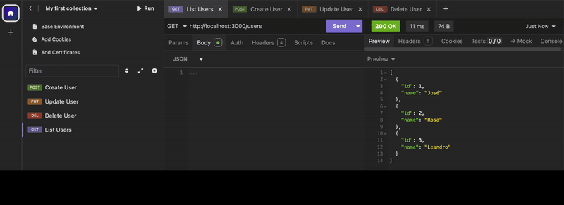

# Http Server
Servidor HTTP criado com Node.js puro, com rotas dinâmicas, manipulação de query strings e simulação de dados em memória. 



## ✨ Funcionalidades

- Roteamento manual (incluindo rotas dinâmicas como `/users/:id`)
- Manipulação de query strings (`?order=asc` ou `desc`)
- Simulação de banco de dados com um array de usuários
- Separação entre rotas, controladores e dados
- Testes realizados com **Insomnia**
- 
## 🚀 Como rodar

1. Clone o repositório
2. Instale o Node.js (caso ainda não tenha)
3. Execute o servidor:

```bash
node index.js

